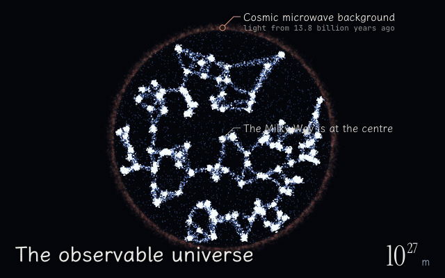
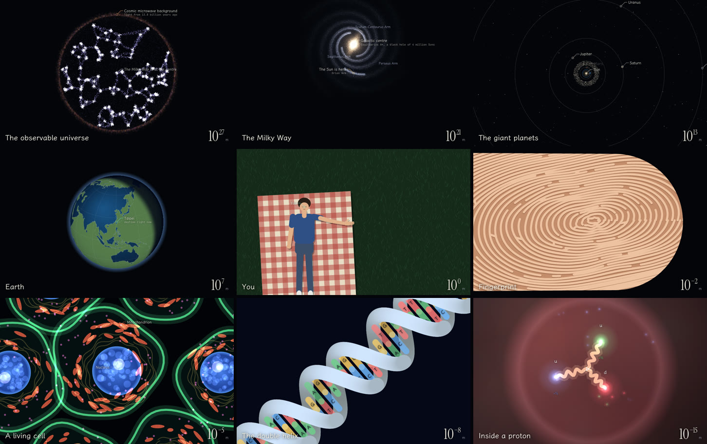

# 42 個數量級

[English](README.md) · 繁體中文

**[打開來看](https://seanlu2006.github.io/42-orders-of-magnitude/)** · 一個 HTML 檔 · 中英雙語 · 手機也能用



一個網頁，從可觀測宇宙的邊緣（8.8 × 10²⁶ 公尺）一路縮小到質子裡面（1.7 × 10⁻¹⁵ 公尺），中間不切鏡頭。兩者相差約 5 × 10⁴¹ 倍，指數四捨五入剛好是 42。沿路會經過銀河系、太陽系、地球、臺北的一座公園、躺在野餐墊上的你、你的指尖、活細胞、DNA，最後是一顆碳原子。

整頁沒有用任何照片、貼圖或函式庫，每一幀都用 Canvas 2D 即時畫出來。在一台 M5 Mac 上實測十個場景，全部跑在每秒 166 幀。

有一部分是當場算的。行星位置、月亮的位置和月相、地球上的晝夜分界，都照你打開頁面的那一刻算。



## 怎麼做出來的

這不是我寫的，點子也不是我想的。我在 Claude Code 裡對 Claude Opus 5.5 下了一句 prompt：

> 你是 opus 5.5，當前世界最強模型，請發揮你的想像力，動用你所有的能力，做一件事情，讓每一個看到你的結果的人，無論是 AI 專家還是不懂科技的文科生、小孩子，看到後都會驚嘆，opus 你真是太厲害了。你會做什麼呢？

點子、程式、說明文字和事實查核，都是 Claude 做的。做完它把每一站開進瀏覽器檢查，邊看邊修。舉三個例子：一層原子只畫出 22% 的透明度，因為發光函式沒把透明度設回來；日球層的淡入條件寫反，所以從來沒出現過；結尾畫面原本寫「你剛好在這趟路的中間」。其實不是。宇宙在你上方 27 個數量級，質子只在下方 15 個。

我請它推上 GitHub 之後，它又加了英文介面、截圖腳本和這份 README。程式碼我沒有改過。

## 怎麼操作

- 滾輪、雙指縮放、上下拖曳都能縮放。↓ ↑ 跳到下一站或上一站，空白鍵開始或暫停導覽，點右邊的尺可以直接飛過去。
- 每一站都有自己的連結，例如 [`#earth`](https://seanlu2006.github.io/42-orders-of-magnitude/#earth)、[`#dna`](https://seanlu2006.github.io/42-orders-of-magnitude/#dna)、[`#proton`](https://seanlu2006.github.io/42-orders-of-magnitude/#proton)。完整清單在[英文版](README.md)最下面。
- 語言跟著瀏覽器走：中文瀏覽器顯示繁體中文，其他顯示英文。右上角可以切換，切過就會記住。
- 按「開始旅程」會一起打開聲音，其他情況預設關閉，右上角可以切換。低音的音高會跟著尺度變，每到一站響一聲。

## 哪些是真的

**打開頁面時即時算的**

- 行星位置：用 J2000 平均軌道根數，每顆行星解一次克卜勒方程式。沒有算軌道傾角和攝動。
- 月亮的黃經：平黃經加上最大的週期項。拿 2026 年 8 月 28 日的月偏食（UTC 04:13）來對，算出月亮離太陽 179.0°，離正對面差大約 1 度。月亮亮的那一半朝向算出來的太陽，標籤上的月相和照亮比例也是同一組數字算的。
- 太陽直射點：用太陽黃經和格林威治恆星時算出來，決定地球上的晝夜陰影。地球以臺北為中心。

**真實資料**

- 海岸線：Natural Earth 的 1:50m 陸地。簡化後剩 732 個環、11,106 個點，壓成差分整數約 60 KB。臺灣用的是沒簡化過的 1:50m 輪廓（61 個點，再用樣條曲線修圓），周圍的海岸用簡化過的資料。
- 24 顆有名字的恆星、兩個星團和獵戶座大星雲的距離與赤經，還有航海家 1、2 號的大約距離。

**照物理或幾何做的模型**

- 碳原子的電子雲：每一幀從 Slater 型軌域的機率密度（1s、2s、2p）重新抽 2,400 個電子位置（開啟減少動態效果時是 900 個），p 軌域照角度抽樣，顏色代表波函數的正負號。
- B 型 DNA：半徑 1 奈米、每圈 3.4 奈米、每圈 10 個鹼基對。兩股錯開 144°，所以會有一寬一窄的溝。
- 銀河系：四條螺距角 12° 的對數螺旋臂，棒狀結構和「太陽－銀心」連線夾 27°。太陽在離中心 2.6 萬光年的地方，夾在人馬臂和英仙臂之間。大約五十萬個點，載入時畫一次。
- 其他七顆行星照真實直徑並排，加起來約 38 萬公里。只有月球在遠地點附近時，才塞得進地球和月球之間，說明文字也是這樣寫的。
- 碳 12 原子核用簡單的重疊排斥收成一團。質子裡的三個夸克，用 Y 字形的色通量管連在一起。

**示意用的**

- 宇宙網和拉尼亞凱亞的流線是程式生成的。
- 臺北的街道是生成的。臺灣的地形是用手動擺放的山脊線做出來的，玉山的位置對，山谷是猜的。
- 星圖上離太陽的距離是真的，方向只照赤經排。它是平面圖，不是從某個地方看出去的樣子。
- 太陽系畫面裡的行星有放大。細胞的顏色仿照螢光顯微鏡。野餐墊上的人是畫的。

## 原理

整個鏡頭只有一個數字 `z`：畫面短邊能放下幾公尺，再取以 10 為底的對數。每公尺幾個像素，就是 `min(寬, 高) / 10^z`。所有場景都用真實的公尺當單位，圍著同一個點畫，也就是你正在放大的那個點。所以航海家號、大安森林公園裡的一棵樹和一顆夸克，走的都是同一個兩行的座標轉換。雙精度浮點數從 10⁻¹⁵ 到 10²⁷ 都裝得下，不用另外縮放。

25 個圖層各有一段看得見的 `z` 範圍，兩端淡入淡出。會蓋滿整個畫面的圖層照尺度從大到小畫，所以小尺度永遠蓋在它來自的大尺度上面。導覽就是 27 個 `z` 值，中間用緩動曲線飛過去。

隨機數用固定種子（mulberry32），每次打開，生成場景的排列都一樣。電子雲和質子裡的夸克對是例外，它們故意一直抽新的亂數。載入時，各圖層趁標題畫面那段時間輪流準備，一幀三層。吃重的東西先畫進離屏畫布：銀河系、臺灣的地形陰影、遠看的城市燈光、公園的草地和步道、星系貼圖、地球的晝夜陰影。會動的、要保持銳利的，每一幀重畫。

## 建置

`index.html` 是產生出來的。改 `src/page.html`，然後：

```sh
node tools/build.mjs    # 把 src/geo.js 塞進頁面、寫出 index.html、檢查程式能解析
```

要重新產生海岸線資料或 `docs/` 裡的圖：

```sh
curl -L -o land-50m.json https://cdn.jsdelivr.net/npm/world-atlas@2.0.2/land-50m.json
node tools/make-geo.mjs land-50m.json    # 寫出 src/geo.js
node tools/build.mjs                     # 用新資料重建 index.html
node tools/capture.mjs                   # 用無頭 Chrome 截 index.html 到 .capture/
sh tools/make-media.sh                   # 用 ffmpeg 把 .capture/ 做成 docs/ 裡的圖
```

需要 Node 22 以上（截圖腳本用到內建的 WebSocket）。截圖腳本預設找 `/Applications` 裡的 Google Chrome（別的路徑用 `CHROME` 環境變數指定），`make-media.sh` 需要 ffmpeg。不用裝任何 npm 套件。

## 致謝

- 海岸線資料來自 [Natural Earth](https://www.naturalearthdata.com/)（公有領域），用的是 [world-atlas](https://github.com/topojson/world-atlas) 整理好的檔案（ISC）。
- 字型：[霞鶩文楷 TC](https://fonts.google.com/specimen/LXGW+WenKai+TC)、[Instrument Serif](https://fonts.google.com/specimen/Instrument+Serif)、[JetBrains Mono](https://fonts.google.com/specimen/JetBrains+Mono)，都是 SIL OFL 授權，由 Google Fonts 提供。
- 野餐墊是向 Charles 與 Ray Eames 1977 年的短片《Powers of Ten》致意。

程式碼採 [MIT 授權](LICENSE)。
